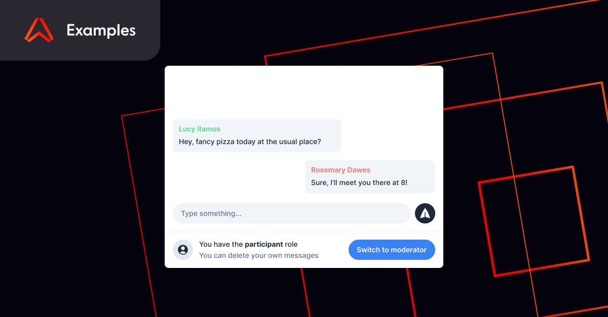

## Overview

This folder contains the code for User Claims - a demo leveraging Ably's [user claims](https://ably.com/docs/core-features/authentication#jwt-claims) feature to allow users to delete their own or other's messages depending on their privilege level.

Try out the [live demo](https://examples.ably.dev/user-claims) of the Chat Admin Privileges.

## Running locally

- Fork or clone the [Examples Repo](https://github.com/ably-labs/realtime-examples).
- Sign up for an account on [Ably](https://ably.com/sign-up?utm_source=ably-labs&utm_medium=github&utm_campaign=user-claims) and get an API KEY.
- Rename `.env.example` to `.env` and fill in your API KEY in the `VITE_ABLY_KEY` environment variable.
- Run `yarn` to install dependencies.
- Run `yarn dev` and go to http://localhost:5173

## Runtime Requirements

- [Node.js](https://nodejs.org/en/)
- Ably API Key
- [Yarn](https://yarnpkg.com/)

## Resources

- Learn more about how to use [user claims](https://ably.com/examples/user-claims?utm_source=ably-labs&utm_medium=github&utm_campaign=user-claims).
- To see what else is possible with Ably check out our other [realtime examples](https://ably.com/examples?utm_source=ably-labs&utm_medium=github&utm_campaign=user-claims).

## Support, feedback and troubleshooting

- [Create a GitHub Issue](https://github.com/ably-labs/realtime-examples/issues)
- [Join our Discord server](https://discord.gg/q89gDHZcBK)
- [Follow us on Twitter](https://twitter.com/ablyrealtime)
- [Use our SDKs](https://github.com/ably/)
- [Visit our website](https://ably.com?utm_source=ably-labs&utm_medium=github&utm_campaign=user-claims)

---

